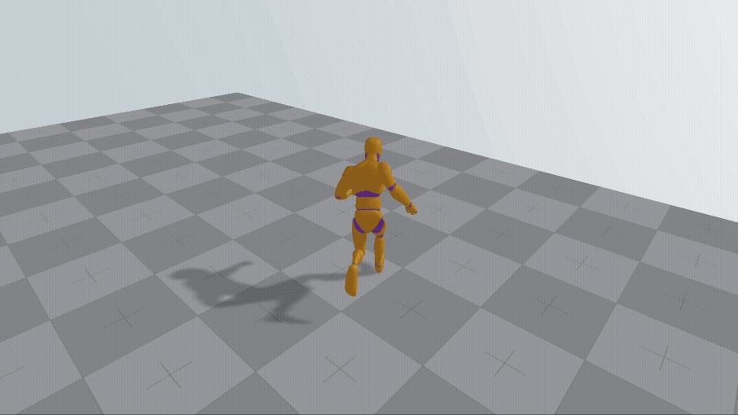

<h1 align="center">@react-three/viverse</h1>
<h3 align="center">Toolkit for building Three.js and React Three Fiber Apps for VIVERSE and beyond.</h3>
<br/>

<p align="center">
  <a href="https://npmjs.com/package/@react-three/viverse" target="_blank">
    
  </a>
  <a href="https://npmjs.com/package/@react-three/viverse" target="_blank">
    
  </a>
  <a href="https://twitter.com/pmndrs" target="_blank">
    
  </a>
  <a href="https://discord.gg/ZZjjNvJ" target="_blank">
    
  </a>
</p>

> Build character-based XR, Desktop, or Mobile web games, the easy way.

```bash
npm install three @react-three/fiber @react-three/viverse
```

### What does it look like?

| A prototype map with the `<SimpleCharacter/>` component and its default model. |  |
| --------------------------------------------------------------------------- | --------------------------------------------------------------------- |

```tsx
import { createRoot } from 'react-dom/client'
import { Sky } from '@react-three/drei'
import { Canvas } from '@react-three/fiber'
import { Viverse, SimpleCharacter, BvhPhysicsBody, PrototypeBox } from '@react-three/viverse'

createRoot(document.getElementById('root')!).render(
  <Canvas shadows>
    <Viverse>
      <Sky />
      <directionalLight intensity={1.2} position={[5, 10, 10]} castShadow />
      <ambientLight intensity={1} />
      <SimpleCharacter />
      <BvhPhysicsBody>
        <PrototypeBox scale={[10, 1, 15]} position={[0, -0.5, 0]} />
      </BvhPhysicsBody>
    </Viverse>
  </Canvas>,
)
```

## How to get started

> Some familiarity with
> react, threejs, and @react-three/fiber, is recommended.

Get started with **[building a simple game](https://pmndrs.github.io/viverse/tutorials/simple-game)**, take a look at our **[examples](https://pmndrs.github.io/viverse/getting-started/examples)**, or follow one of our **tutorials**:

- [First person controls](https://pmndrs.github.io/viverse/tutorials/first-person)
- [Augmented and virtual reality](https://pmndrs.github.io/viverse/tutorials/augmented-and-virtual-reality)
- [Accessing avatar and profile](https://pmndrs.github.io/viverse/tutorials/access-avatar-and-profile)
- [Equipping the character with items](https://pmndrs.github.io/viverse/tutorials/equipping-items)
- [Using custom animations and models](https://pmndrs.github.io/viverse/tutorials/custom-models-and-animations)
- [Actions](https://pmndrs.github.io/viverse/tutorials/actions)
- [Custom Character Controller](https://pmndrs.github.io/viverse/tutorials/custom-character-controller)
- [How to remove the viverse integrations](https://pmndrs.github.io/viverse/tutorials/remove-viverse-integrations)
- [Publish to VIVERSE](https://pmndrs.github.io/viverse/tutorials/publish-to-viverse)

## Not into react?

> No Problem

Check out how to build games using @pmndrs/viverse and only [vanilla three.js](https://pmndrs.github.io/viverse/without-react/introduction).

## Acknowledgments

This project would not be possible without the default model and default animations made by [Quaternius](https://quaternius.com/), the prototype texture from [kenney.nl](https://www.kenney.nl/), the [three-vrm project](https://github.com/pixiv/three-vrm) from the [pixiv team](https://github.com/pixiv), [three-mesh-bvh](https://github.com/gkjohnson/three-mesh-bvh) from [Garrett Johnson](https://github.com/gkjohnson) and is based on prior work from [Felix Zhang](https://github.com/felixtrz) and [Erdong Chen](https://github.com/ErdongChen-Andrew)!

## Sponsoring

The development of this library was sponsored by HTC Viverse.