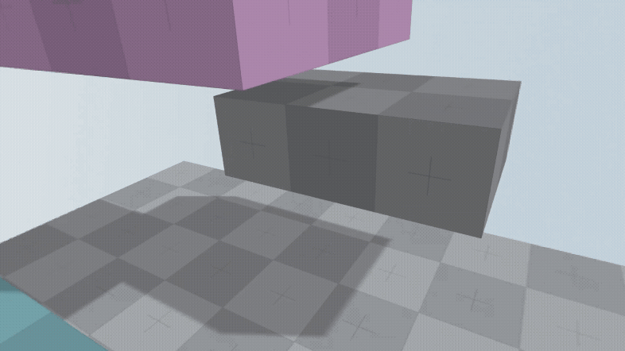

<Grid cols={2}>
  <li>
      
    Simple Game Example w. a Player Tag
  </li>
  <li>
      
    Simple Game Example using Vanilla Threejs
  </li>
  <li>
      
    Augemented Reality Example using WebXR
  </li>
  <li>
      
    Virtual Reality Example using WebXR
  </li>
  <li>
      
    Fortnite Character Controller Example
  </li>
</Grid>
