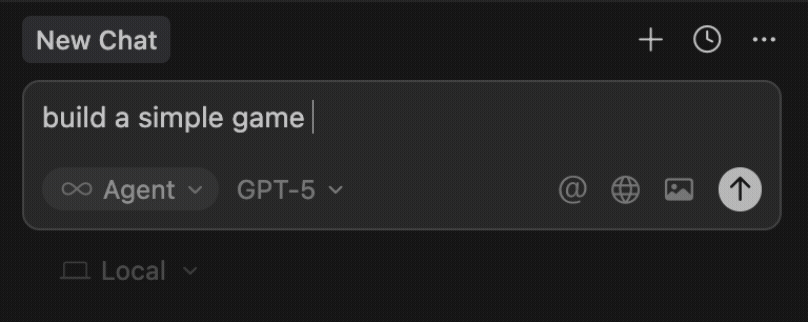

This tutorial shows how to collaborate with an AI coding assistant (e.g. Cursor) using the official `@react-three/viverse` docs so the AI reliably uses the right APIs and components.

## Step 1: Add the docs to your coding environment

Add the docs as a custom source so your AI can reference them while coding.

- Add this file as a custom doc source: [llms.txt](https://pmndrs.github.io/viverse/llms.txt)
- In Cursor: press `CMD+Shift+P` (macOS) or `Ctrl+Shift+P` (Windows), search for “Add new custom docs”, and paste the URL:

```text
https://pmndrs.github.io/viverse/llms.txt
```

and name then name the docs `Viverse`

## Step 2: Reference the docs in your prompts

When prompting, explicitly tell the AI to use the saved docs. If you saved them as “Viverse”, write prompts like:



> Build a simple game using @Viverse

> [!IMPORTANT]
> Keep referencing the docs in follow-up prompts (e.g., “Using the @Viverse docs, add first person controls") so the AI sticks to official components and APIs.

## Step 3: Run and test the game

Ask the AI to start the dev server, or run it yourself:

```bash
pnpm dev
# or
npm run dev
```

Open `http://localhost:5173` to test your game.

## Step 4: Publish

Once you like your game, you can ask the AI to publish it by providing your VIVERSE email and password and referencing the VIVERSE docs (e.g., “Using the @Viverse docs, to publish the game using email: my-email and password: my-password").

For a manual CLI-based workflow, see **[Publish to VIVERSE](../tutorials/publish-to-viverse.md)**.


