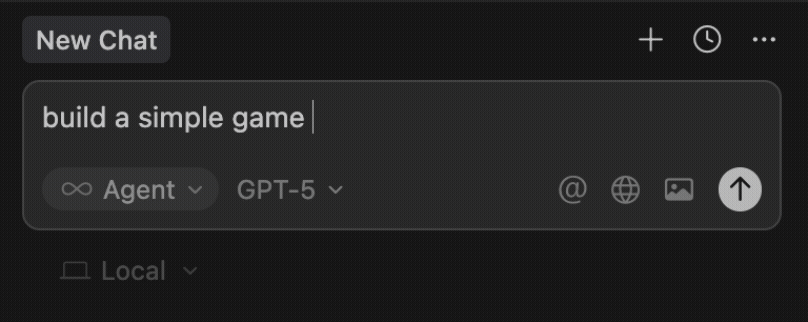

This tutorial shows how to collaborate with an AI coding assistant using the official `@react-three/viverse` docs so the AI reliably uses the right APIs and components.

## Step 1: Add the docs to your coding environment

Use the setup path that matches your AI coding tool.

### Option A: Install the Codex skill

If your agent supports installable skills, install the `pmndrs-viverse` skill from this repository:

```bash
npx skills add pmndrs/viverse
```

Then invoke it in prompts with `$pmndrs-viverse`.

### Option B: Add llms.txt as custom docs

If your editor supports custom documentation sources, add the generated docs file.

- Add this file as a custom doc source: [llms.txt](https://pmndrs.github.io/viverse/llms.txt)
- In Cursor: press `CMD+Shift+P` (macOS) or `Ctrl+Shift+P` (Windows), search for “Add new custom docs”, and paste the URL:

```text
https://pmndrs.github.io/viverse/llms.txt
```

and name the docs `Viverse`.

## Step 2: Reference the docs in your prompts

When prompting, explicitly tell the AI to use the saved docs or installed skill.

If you installed the skill, write prompts like:

> Use $pmndrs-viverse to build a simple game

If you saved the docs as “Viverse”, write prompts like:



> Build a simple game using @Viverse

> [!IMPORTANT]
> Keep referencing the docs in follow-up prompts (e.g., “Using the @Viverse docs, add first person controls") so the AI sticks to official components and APIs.

## Step 3: Run and test the game

Ask the AI to start the dev server, or run it yourself:

```bash
pnpm dev
# or
npm run dev
```

Open `http://localhost:5173` to test your game.

## Step 4: Publish

Once you like your game, ask the AI to help with the publish flow using the VIVERSE docs, but do not paste passwords, tokens, client secrets, or other credentials into prompts. Prefer interactive CLI login, local environment variables, or running the authentication command yourself.

For a manual CLI-based workflow, see **[Publish to VIVERSE](../tutorials/publish-to-viverse.md)**.
